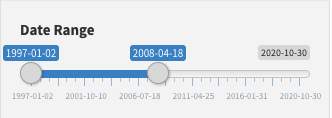
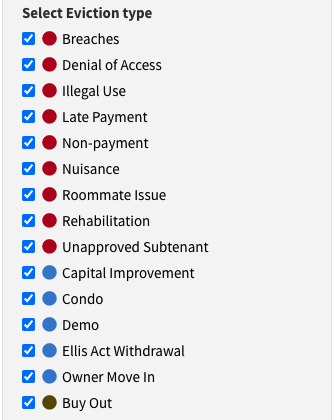
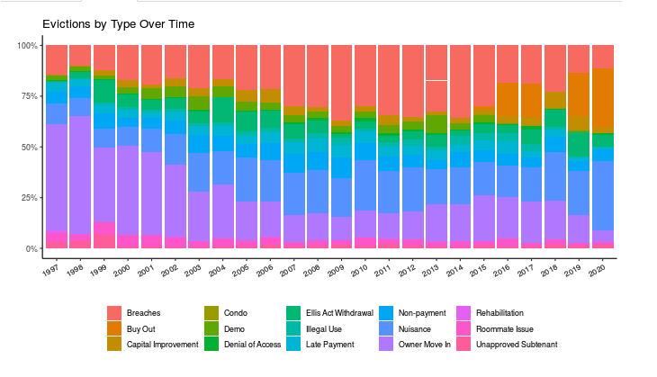

## 458-Final-Essay
Analysis of San Francisco anti-eviction webmap

## Link to the Map
https://antievictionmap.com/sf-evictions

### Introduction
For my project I chose to analyze an interactive web map on evictions in San Francisco ranging from 1997 to 2020. The main goal of the project is to highlight location, time, and type of evictions occuring in San Francisco. The map is sampled over a large time period, which allows users to analyze spatial and temporal trends relating to eviction frequency and type. The map has many useful features and functions to go along with persuasive visualizations. Some of the functions include a timeline, allowing the user to filter data for a selected period, a filter saying yes or no as to whether the user wants to include the undermined eviction type, and buttons to filter all eviction types, in which the user may select any number and combination of the 15 different eviction categories. One feature of the map that I enjoy is that under the map they have total counts listed for each eviction type, giving the user additional context on top of the visualization. The web map does not have a scale bar or legend, but it is a clear black and white basemap that gives the viewer a string context of location in San Francisco. The intended audience can be anybody interested in demographics of the bay area, while it is likely made to persuade public policymakers about housing issues and areas that are having trouble with unaffordable rent prices. The web map was made by members of the Anti-Eviction Mapping project, which is a group of tenants motivated toward housing justice in the San Francisco Bay Area. The project appears to have collected the housing data themselves, but they reference Leaflet and OpenStreetMap for the base map and Stamen Design for the creation of the map tiles. 

### System Architecture
I had trouble finding much information about system architecture, particularly the internal network finding what database and file servers interact with the geospatial server. In terms of storage, the source code appears to have an indexedDB and webSQL. 
The access to the web server is an HTML file, and the HTML has a lot of information on the standard squarespace template used to create the webpage. The squarespace template has a standard HTML structure, with HTML elements, nodes, event targets, and objects. The interactive web elements to this map really make it come alive, and they provide the difference between a piece of information to a full story about evictions. This is accomplished  through the timeline feature, which allows the viewer to better grasp the narrative of increased eviction rates.

#### System architecture images 

### UI/UX and Design
Overall this webpage does a good but not great job of incorporating responsive design. The screen adjusts smoothly and easily to different sizes, but the webpage as a whole only takes up a portion of the screen, leaving a lot of empty black space that could be used more effectively. Responsive design is key to a user friendly web page, as well as marketing a webpage because Google’s algorithms rank responsive designs higher in searches. Overall I really enjoy the user experience that comes with this webmap. One key aspect I took away from the “Affective Geovisualizations” reading by Stuart Aitken and James Craine was the emphasis on filmic spatial data. This map embodies the bridge between maps and cinema due to the narrative aspect, as well as the changing hues and colors that complement each other well in the dynamic map. It starts with the simple but informative black and white basemap. The basemap is taken from OpenStreetMap and accessed through leaflet, but it provides descriptive information about San Francisco’s streets and neighborhoods while not looking too clustered. To add on to the basemap, the webpage only has one thematic layer, which consists of dots representing each instance of eviction. The map is on a small enough scale and is describing a rare enough topic that each dot can represent a single occurrence, resulting in no need for a dot density map. The map is easy to navigate around and the dots adjust in size smoothly and quickly based on the scale of the map. 
While everything on the surface level appears strong, there are some improvements I would have made if I was making the map myself. First of all, the creator assigned the dots to 3 different color categories, red blue and black, to represent certain groups of eviction types, but it is not clear what merits each grouping. Nine evictions are colored red, five blue, and one black, but to the normal viewer like myself who is not well aware of the landlord language, some more description about the categorizations is necessary. My guess is that the red dots are evictions at the fault of the owner, and the blue dots are at the fault of the landlord, but that is difficult to interpret.

#### Legend

One other interactive element that I would add to go along with the dot coloring issue would be a hover feature overlaid on each visible dot. This feature could contain information such as the address and unit type of each eviction, the date it happened, and the specific eviction type to bring more clarity. I put myself in someone’s shoes shopping for houses, and if I see that the tenants before me got evicted, it would be nice to click on the property and figure out why. This map provides no means. 
On a positive note, the map does excel in user experience by including the plot tab alongside the map. The plots better visualize temporal changes in eviction types and use excellent color schemes to make the data clear. They show two plots, one comparing eviction types as a percentage of the total evictions for a given year, and another comparing total counts of eviction year by year. Being able to navigate easily between the map and the plot is a desirable feature as well.

### Pros and Cons
When I think about how interacting and viewing this webpage influenced me as a whole, I think the mapmakers should be happy with their goals. They have an agenda of persuading people to take more action against rent spikes, and make more friendly tenant laws. Seeing the incredibly high density of evictions, especially the number in recent years causes the viewer to side with the tenants. A pro of this map is that it effectively uses data as support for their argument, and there not not appear to be any strong subjective views or bias present. The Anti-Eviction project provides a great context for their mission on their homepage, as they work on collecting as much information as possible on gentrifying landscapes. To go along with this, they describe their goals of resistance as, “Maintaining antiracist and feminist analyses as well as decolonial methodology, the project creates tools and disseminates data contributing to collective resistance and movement building.” This web map is just one of many that highlight issues in the city of San Francisco that has a rich urban culture but has still fallen victim to gentrification. A con to this map is its ability to be taken out of context or misinterpreted. Not all evictions are due to gentrification, and many come as the result of misbehavior. That is why the color and classification of evictions are so important, because it is easy to look at a map of dense dots over a mall area and pin it all on property value increases or landlords. This is where the chart counters this argument well, because they have clear and concise colors to classify all eviction types.

### Conclusion and Reflection
Overall, the correlation between discrimination and geography date back further than we know, and the rise of digital mapping brings light to these issues. This map is one of many products that have arisen in the development of tools for resistance. The digital age and the information sharing occurring through the internet have given a voice to the minority, and a voice to those not in a position of power. Digital mapping and social media allow people to question what is perceived as right, and that is the end goal of this map. The context of arguing what is right with this project refers to us assuming that renovating buildings to make them look nicer is always a good thing. It is not, and the creators tell us this by putting into a spatial perspective how many people get displaced as a result. 
Another issue that arises from digital mapping is surveillance, and the notion that we are always being watched. I do not see this project as a whole touching on that issue, because I think they are using location data in a positive manner, and not crossing any personal housing boundaries. Getting evicted is s\not something to pin on one's identity, and their gathering of historical data does not bother with that issue. The end result is an aimed power balance between the people making the rules and those abiding by them. Tenants have no control over what is done with their property despite paying to live there, and this map effectively puts into perspective the number of people that have fallen victim to the power imbalance in housing.
